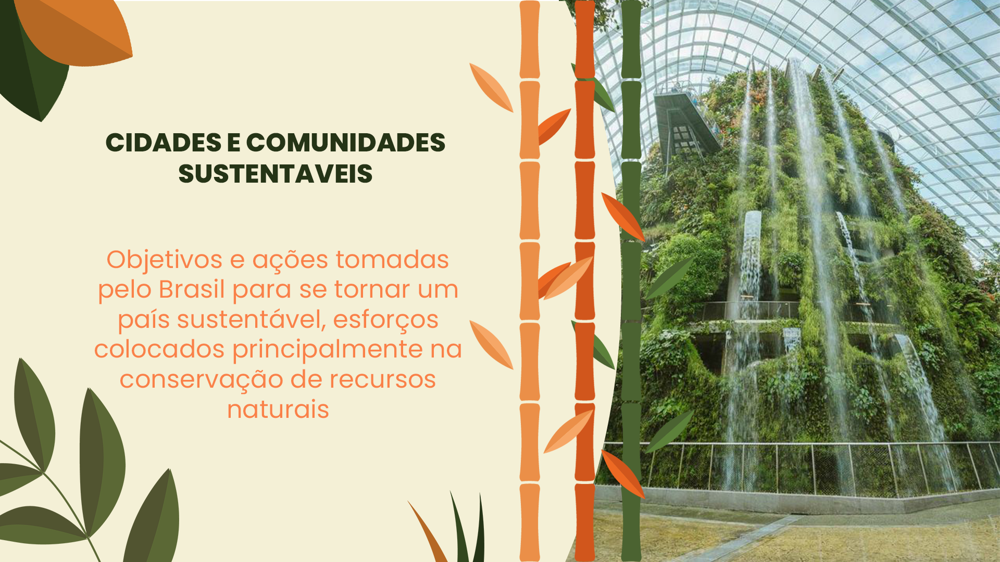

# Projeto Agenda 2030 no Brasil

Projeto para feira de ciências escolar: Site Inspirado na ONU infomando sobre cidades e comuninidades sustentaveis

## Descrição

Este é um projeto onde apresentamos as ações do Brasil para ter um país sustentavel.
Então decidimos usar nossos conhecimentos em desenvolvimento web para fazer nossa aprensentação da feira de ciências
uma coisa bem divertida.

## Como acessar:

1. Abra nosso projeto pelo link: [Projeto](https://site-onu.vercel.app/)
2. Navegue pela barra superior ou cards encontrados quando desliza a tela

## Autores

- Ricardo Batista [@RicardoFonse](https://github.com/RicardoFonse)
- João Marcelo [@JaoMar1301](https://github.com/JaoMar1301)
- Mateus Gonçalves [@Tue-GBS](https://github.com/Tue-GBS)

## Notas Adicionais

Este projeto foi desenvolvido como parte de um exercício escolar e não tem afiliação oficial com as Nações Unidas.

## Contato

Se você tiver alguma dúvida ou feedback, sinta-se à vontade para entrar em contato conosco através do email: dmateus132005@gmail.com.
